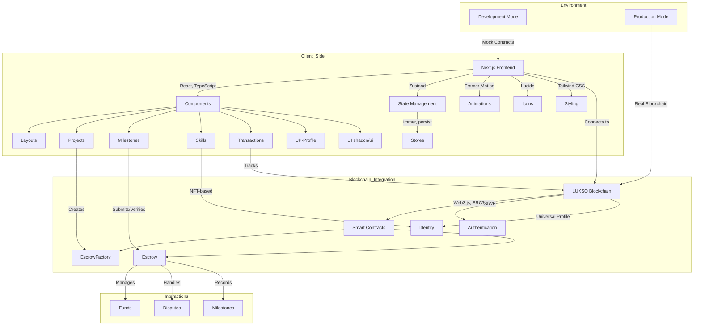

# TrustLink - Decentralized Freelance Platform on LUKSO

TrustLink is a decentralized freelance platform built on the LUKSO blockchain that connects freelancers and clients through smart contracts. It provides a secure, transparent, and efficient way to manage freelance projects with built-in escrow functionality, milestone-based payments, and dispute resolution.

## Features

- **Universal Profile Integration**: Connect with LUKSO Universal Profiles for identity and authentication
- **Smart Contract Escrow**: Secure funds in escrow contracts with milestone-based releases
- **Milestone Verification**: Submit and verify project milestones with on-chain evidence
- **Dispute Resolution**: Built-in dispute resolution mechanisms with multiple options
- **Skill Verification**: Verify skills with NFT-based credentials
- **File Attachments**: Attach files to projects and milestones
- **Client Invitation System**: Invite clients to collaborate on projects
- **Transaction History**: Track all blockchain transactions related to projects

## Tech Stack

- **Frontend**: Next.js, React, TypeScript, Tailwind CSS, shadcn/ui
- **Blockchain**: LUKSO, Web3.js, ERC725.js
- **Authentication**: Sign-In with Ethereum (SIWE)
- **State Management**: Zustand with immer and persist middleware
- **UI/UX**: Framer Motion for animations, Lucide for icons

## Getting Started

### Prerequisites

- Node.js 16+
- LUKSO Universal Profile (UP) Browser Extension
- LUKSO testnet tokens for testing

### Installation

1. Clone the repository:
   \`\`\`bash
   git clone https://github.com/yourusername/trustlink.git
   cd trustlink
   \`\`\`

2. Install dependencies:
   \`\`\`bash
   npm install
   \`\`\`

3. Create a `.env.local` file with the following variables:
   \`\`\`
   NEXT_PUBLIC_DEFAULT_NETWORK=testnet
   NEXT_PUBLIC_ESCROW_FACTORY_ADDRESS=your_deployed_contract_address
   \`\`\`

4. Start the development server:
   \`\`\`bash
   npm run dev
   \`\`\`

5. Open [http://localhost:3000](http://localhost:3000) in your browser.

## Smart Contracts

TrustLink uses two main smart contracts:

1. **EscrowFactory**: Creates new escrow contracts for projects
2. **Escrow**: Manages funds, milestones, and dispute resolution for a specific project

### Contract Deployment

The contracts are deployed on the LUKSO testnet. To deploy your own contracts:

1. Install the LUKSO CLI:
   \`\`\`bash
   npm install -g @lukso/cli
   \`\`\`

2. Deploy the contracts:
   \`\`\`bash
   lukso deploy --network testnet
   \`\`\`

3. Update the contract addresses in `lib/lukso/lukso-config.ts`.

## Real Blockchain Integration

TrustLink now uses real blockchain integration instead of mock contracts. This means:

1. All transactions are sent to the actual LUKSO blockchain
2. Escrow contracts are created on-chain
3. Milestone submissions and approvals are recorded on-chain
4. Dispute resolution happens through the blockchain

To use the real blockchain integration:

1. Make sure you have LUKSO tokens in your Universal Profile
2. Connect your Universal Profile through the app
3. Create projects and interact with them normally

The app will handle all blockchain interactions and provide status updates for transactions.

## Development vs. Production

- **Development Mode**: Uses mock contracts and simulated blockchain interactions
- **Production Mode**: Uses real blockchain integration with actual LUKSO contracts

To switch between modes, update the `USE_MOCK_CONTRACTS` flag in `stores/use-freelance-store.ts`.

## Project Structure

```md
trustlink/
├── app/                  # Next.js app router
│   ├── layout.tsx        # Root layout
│   ├── page.tsx          # Home page
│   ├── new-project/      # Project creation
│   ├── project/          # Project details
│   └── profile/          # User profile
├── components/           # React components
│   ├── layouts/          # Layout components
│   ├── projects/         # Project-related components
│   ├── milestones/       # Milestone components
│   ├── skills/           # Skill verification
│   ├── transactions/     # Transaction components
│   ├── up-profile/       # Universal Profile components
│   └── ui/               # UI components (shadcn/ui)
├── lib/                  # Utility functions
│   └── lukso/            # LUKSO SDK and utilities
├── stores/               # Zustand stores
├── types/                # TypeScript types
└── public/               # Static assets
```
## Contributing

Contributions are welcome! Please feel free to submit a Pull Request.

## License

This project is licensed under the MIT License - see the LICENSE file for details.

## Acknowledgements

- LUKSO for the blockchain infrastructure
- shadcn/ui for the component library
